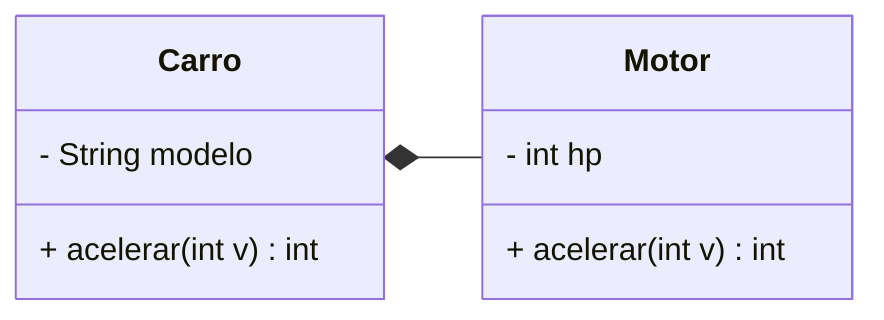

# Diagrama de classes

```mermaid
classDiagram

    direction LR

    class Carro{
        - String modelo
        + acelerar(int v) int
    }

    class Motor{
        - int hp
        + acelerar(int v) int
    }
    
    Carro *-- Motor
```