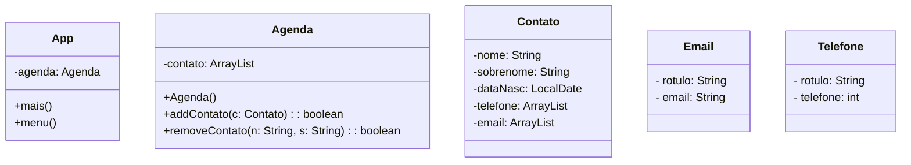

# Diagrama de Classes #

```mermaid
classDiagram
    class App{
        -agenda: Agenda
        +mais()
        +menu()
    }

    class Agenda{
        -contato: ArrayList<Contato>
        +Agenda()
        +addContato(c: Contato): boolean
        +removeContato(n: String, s: String): boolean
    }

    class Contato{
        -nome: String
        -sobrenome: String 
        -dataNasc: LocalDate 
        -telefone: ArrayList<Telefone> 
        -email: ArrayList<Email> 
    }

    class Email{
        - rotulo: String 
        - email: String
    }

    class Telefone{
        - rotulo: String 
        - telefone: int 
    }
```