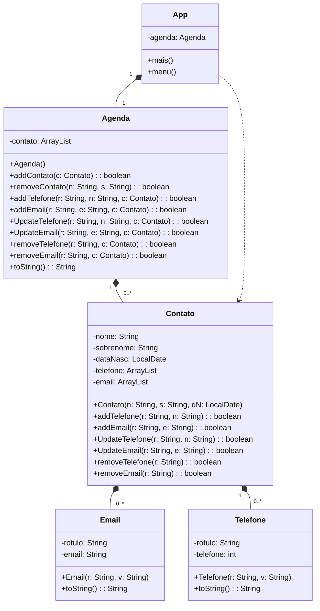

# Diagrama de Classes #

```mermaid
classDiagram
    class App{
        -agenda: Agenda
        +mais()
        +menu()
    }

    App "1" *-- "1" Agenda

    class Agenda{
        -contato: ArrayList<Contato>
        +Agenda()
        +addContato(c: Contato): boolean
        +removeContato(n: String, s: String): boolean
        +addTelefone(r: String, n: String, c: Contato): boolean
        +addEmail(r: String, e: String, c: Contato): boolean
        +UpdateTelefone(r: String, n: String, c: Contato): boolean
        +UpdateEmail(r: String, e: String, c: Contato): boolean
        +removeTelefone(r: String, c: Contato): boolean
        +removeEmail(r: String, c: Contato): boolean
        +toString(): String
    }

    Contato <.. App
    Agenda "1" *-- "0..*" Contato

    class Contato{
        -nome: String
        -sobrenome: String 
        -dataNasc: LocalDate 
        -telefone: ArrayList<Telefone> 
        -email: ArrayList<Email>
        +Contato(n: String, s: String, dN: LocalDate)
        +addTelefone(r: String, n: String): boolean
        +addEmail(r: String, e: String): boolean
        +UpdateTelefone(r: String, n: String): boolean
        +UpdateEmail(r: String, e: String): boolean
        +removeTelefone(r: String): boolean
        +removeEmail(r: String): boolean
    }

    Contato "1" *-- "0..*" Email

    class Telefone{
        -rotulo: String 
        -telefone: int
        +Telefone(r: String, v: String)
        +toString(): String
    }

    Contato "1" *-- "0..*" Telefone
    
    class Email{
        -rotulo: String 
        -email: String
        +Email(r: String, v: String)
        +toString(): String
    }
```